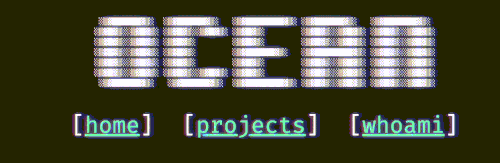

# Who needs a static website generator, if it's a static website

It's been a bit of time that I wanted to revamp my personal website, but didn't really found time or inspiration to do so.
With a relaxing weekend and a bunch of hours to freely nerd at hand, my mind wandered to how I could possibly make bearable maintaining my personal website.

Aside from the general look and feel of my personal website that I wanted to change, there was something haunting me: dependencies.
I seldom update my website, and having to recall commands, or worse having to fix broken dependancies is enough to drain the last bits of will I could have to update my personal website.
Having to juggle between npm, python, pandoc, haskell and whatnot to be able to push a simple post is *unacceptable*.

The other thing that made me despise updating my website was being tied to the workflow that static website generators that
generate html files starting from markdown. This way, you either use the github functionality where you put the static site under the `docs` folder, or you have to resort to a workflow, local, or with github actions, to push the generated site to pages, while keeping the sources somewhere else.
Then you end up with multiple branches or repos just to manage an extremely small and simple website.


## The Micro Web Generator

What if we could just write a Markdown file, push it, and that's it? No compilation, no dependency hell, no messy multi-step workflows.
Fortunately [marked](https://marked.js.org/) is a simple js library that can allow us to do that, and extend it where we need.

I was tempted by this idea, and to simplify things further, at this point, I wanted the website to be a single html page that would load dynamically the markdown files.

> Thou shalt not have dependencies outside of Bash, GNU utils, and Python with standard library.
For convenience, a Makefile is allowed too ;p.

I started implementing a minimal generator, but just to keep things tidy, and be able to merge various sources in the single index file.

``` html
  <include>static/index.css</include>
  <include>static/marked.min.js</include>
  <include>static/renderer.js</include>
```

Something like this, can be easily parsed in python with a regex, so that's almost as much as we need from our web generator,
just need to take care we can process different file types in a different way.

``` python
    def process_md(self):
        """ we will use marked to directly load the included markdown :)"""
        elid = uuid.uuid4()
        with open(self.fname, 'r') as f:
            return f'<div id="{elid}"></div><script>document.addEventListener("DOMContentLoaded", function(event) {{renderEl("{elid}",`{f.read()}`);}});</script>'
```


## A Single Page to Render them all

Changing the path parameters will result in the page reloading, which is quite annoying since we have a single page and the loading happens dynamically,
using URIs will also mean that if a user copy-paste a link will end up on the markdown file, instead of the page that renders it.

At this point our only option is to cram both the path, and the hash in the location hash. Ugly, and not SEO friendly (none of this structure is I guess, but oh well, you win some, you lose some).

We need just to be sure to listen on events such as `hashchange`, and `load` to be able to render the markdown files everytime the user navigate the site in different ways (the click listener is probably redundant but oh well:P).

``` javascript
function renderEl(elid, content){
  marked.use({ marked_highlight });
  marked.use({ renderer });
  document.getElementById(elid).innerHTML = marked.parse(content);
  hljs.highlightAll();
}

function renderFi(target){
  var xhttp = new XMLHttpRequest();
  xhttp.onreadystatechange = function() {
    if (this.readyState == 4 && this.status == 200) {
       renderEl("content", xhttp.responseText);
    }
  };
  xhttp.open("GET", target, true);
  xhttp.send();
}

// intercept all the clicks!
function click_callback(e) {
  var e = window.e || e;

  if (e.target.tagName !== 'A')
      return;

  uri_components = e.target.href.split("#");
  if (uri_components[1] == "/"){
    renderFi("/README.md");
    location.hash = "";
  } else {
    renderFi(`${uri_components[0]}/${uri_components[1]}`);
    location.hash = e.target.hash;
  }
  e.preventDefault(); // Cancel the native event
  e.stopPropagation();// Don't bubble/capture the event any further
  return;
}
function hash_changed(){
  if(!window.location.hash){
    renderFi("/README.md");
  } else {
    uri_components = window.location.href.split("#")
    renderFi(`${uri_components[0]}/${uri_components[1]}`);
  }
}

window.addEventListener("hashchange", (event) => {hash_changed();});
window.addEventListener("load", (event) => {hash_changed();});

if (document.addEventListener) {
    document.addEventListener('click', click_callback, false);
} else {
    document.attachEvent('onclick', click_callback);
}
```

The only thing missing is making sure that we render links properly putting the relative path in the location hash, and we can do so with a custom renderer:

``` javascript
  link({tokens, href}) {
    const text = this.parser.parseInline(tokens);
    const escapedText = text.toLowerCase().replace(/[^\w]+/g, '-');
    return `<a name="${escapedText}" href="#${href}">${text}</a>`;
  },
```

At this point the click event listener is probably redundant, but I'll clean up the code another day.
External links are also put in the hash, so that's something still to solve.

For code highlighting integrating `highlight.js` is a breeze.
A few touches here and there to get some elements such as blockquotes and figures to play nice, and the page is done.


## Bonus glitchy logo

I wanted a nice ASCII logo, and due to how Chrome renders text... it was glitching!



Ok that's cool, I wanted to replicate the effect also on other browsers.
To do so, when including the ASCII logo, I use some spans, and a nice css animation that changes the text size.

``` python
class CustomFileProcessor(FileProcessor):

    def __init__(self, fname, ftype = ""):
        custom_processors = {'ascii': self.process_ascii}
        super().__init__(fname, ftype, custom_processors=custom_processors)

    def process_ascii(self):
        lines = None
        with open(self.fname, 'r') as f:
            lines = [
                l.replace(
                    ' ',
                    '<span class="gspace">&nbsp;</span>'
                ).replace("\n", "<br/>") for l in f.readlines()
            ]

        return ''.join(lines)
```

``` css
  @keyframes glitchSpace {
    0%   { font-size: 1em;   }
    95%  { font-size: 0.3em; }
    100% { font-size: 0.1em; }
  }

  .gspace {
    display: inline-block;
    animation: glitchSpace 0.005s 1;
  }
```

For good measure, let's sprinkle a bit of [CRT effect](https://dev.to/ekeijl/retro-crt-terminal-screen-in-css-js-4afh) on top too.


## Conclusion

I wanted to do a quick test post, if you got to the end, feel also free to fork the [website](https://github.com/ocean1/dvqu.art) or the [micro web generator](https://github.com/ocean1/mwg) and open pull requests.
For the next steps, I guess I'll be fixing the issue with links... :P and probably add a minimal site template to the generator, and documentation.

There's also some things I'd like to explore such as adding a table of content to post pages, and maybe a search functionality.
Perhaps I might explore these ideas in future posts.